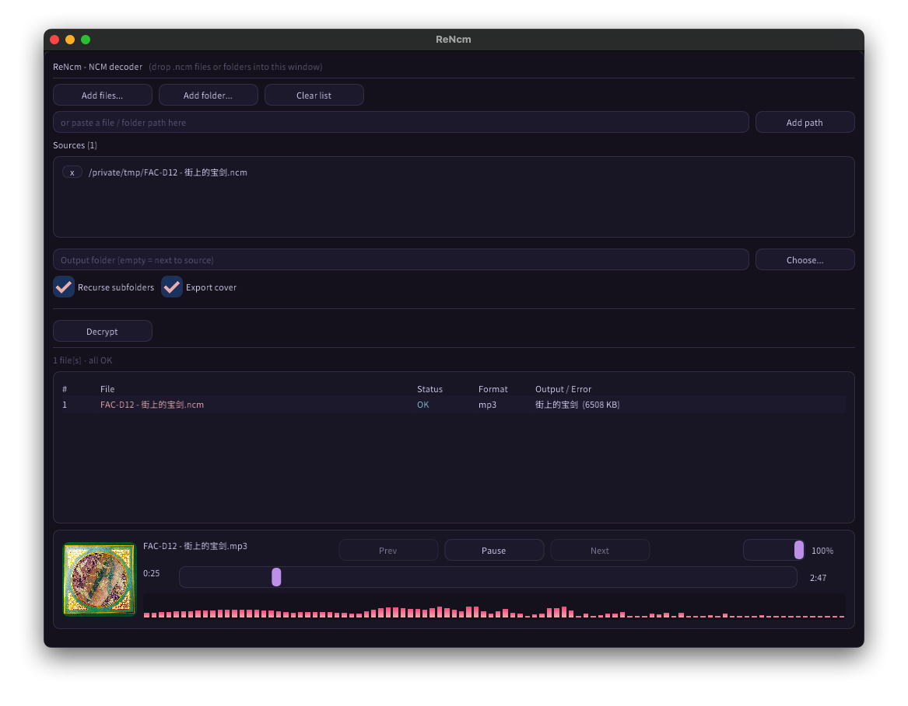

# ReNcm

A `.ncm` (NetEase Cloud Music) decryptor recovered by reverse engineering the
NeteaseMusic macOS binary. The same algorithms ship as three independent
implementations:

| Directory | Language | Form |
| --- | --- | --- |
| `go/` | Go | library + CLI (no third-party dependencies) |
| `rust/` | Rust | library + CLI |
| `cpp/` | C++ | decoder library + ImGui desktop app |

The full reverse-engineering evidence - IDA addresses, field layout, call chain,
pseudocode - is in **[`docs/NCM-FORMAT-ANALYSIS.md`](docs/NCM-FORMAT-ANALYSIS.md)**.

## Algorithm

```
key_blob --XOR 0x64--> AES-128-ECB("hzHRAmso5kInbaxW") --> PKCS#7 unpad
         --> strip "neteasecloudmusic" prefix  ==>  box key
box   = RC4-KSA(box key)
table = precomputed 256-byte keystream, cycled over the audio: audio[i] ^= table[i % 256]
comment --XOR 0x63--> base64 --> AES-128-ECB("#14ljk_!\]&0U<'(") --> JSON
```

> The audio is **not** standard RC4 PRGA; the table form above is equivalent to
> `out[i] = in[i] ^ box[(box[j] + box[(box[j] + j) & 0xff]) & 0xff]`.

## Usage

```bash
# Go
cd go && go build -o rencm ./cmd/rencm && ./rencm song.ncm [out_prefix]

# Rust
cd rust && cargo build --release && ./target/release/rencm song.ncm

# C++ desktop app (first configure fetches GLFW / Dear ImGui / miniaudio / stb_image)
cd cpp && cmake -S . -B build -DCMAKE_BUILD_TYPE=Release && cmake --build build -j
./build/rencm-gui
```

All three work as libraries too:

```go
dec, _ := ncm.Open("song.ncm")           // Go: Decoder implements io.Reader / io.WriterTo
```

```rust
let mut dec = rencm::open("song.ncm")?;  // Rust: Decoder<R> implements std::io::Read
```

```cpp
rencm::Result r; std::string err, out;
rencm::decode_to_file("song.ncm", "", true, r, out, err);   // C++
```

The C++ library has no third-party dependencies: `#include <rencm/rencm.hpp>`, or
`add_subdirectory(rencm)` to reuse it. `-DRENCM_BUILD_GUI=OFF` builds only the
decoder and its tests - what CI uses, so it does not fetch GLFW/ImGui.

## Desktop app



- Drop or pick `.ncm` files / folders, then **Decrypt**; decryption runs on a
  background thread with two-level progress
- Results table (`#` / File / Status / Format / Output / Error); **click any row
  to play that track**
- Player bar: Prev / Play / Next walk the list as a playlist and advance
  automatically, draggable seek, percentage volume, a **spectrum visualiser** and
  a **cover thumbnail**
- English UI, bundled Noto fonts (Chinese / Korean / Cyrillic and more), a
  **single ~11 MB binary**
- Preview supports **mp3 / flac / wav** only (miniaudio's built-in decoders);
  m4a / aac / ogg rows are disabled

Headless and self-test modes:

```bash
./build/rencm-gui song.ncm [out_dir]      # batch decrypt
./build/rencm-gui --fonttest              # font coverage
./build/rencm-gui --playtest song.mp3     # playback (duration / seek / spectrum)
./build/rencm-gui --covercheck cover.jpg  # cover decode (JPEG / PNG)
```

## Verification

For the same sample, all three implementations produce byte-identical output:

```
mp3    ea30a900af1843433ff24459c0351b7076508d489296245ac1c2c9865c9d0026
cover  05a4de5aafc664c9843a7f808e17185d5eff0f7b88969f32af1fa44c8651e71f
ffmpeg -v error -i out.mp3 -f null -      # exits 0
```

## Tests

Pure-function tests (format sniffing, PKCS#7, base64, keystream) always run; the
golden decode needs a real sample, passed via the `RENCM_SAMPLE` environment
variable, and is skipped when unset.

```bash
cd go   && go test ./...
cd rust && cargo test
cd cpp  && cmake -S . -B build -DRENCM_BUILD_GUI=OFF && cmake --build build -j \
           && ctest --test-dir build --output-on-failure

RENCM_SAMPLE=/path/sample.ncm go test ./...   # adds the golden decode
```

`.github/workflows/ci.yml` runs all three on push / PR (including `gofmt` /
`go vet` / `cargo clippy -D warnings`).
